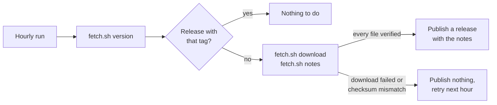

# Binary Mirror Template

English | [繁體中文](README.zh-TW.md) | [简体中文](README.zh-CN.md)

A template for mirroring another project's prebuilt binaries into GitHub Releases, for machines that can reach GitHub but not the upstream's download server. [Mai0313/claude-code-binaries](https://github.com/Mai0313/claude-code-binaries) is built from it.

Click [Use this template](../../generate) to start a new mirror.

## How it works

`.github/workflows/updater.yml` runs every hour:



`scripts/fetch.sh` is the only file that knows about the upstream:

```bash
./scripts/fetch.sh version                # newest upstream version
./scripts/fetch.sh download VERSION dist  # every file of VERSION, verified
./scripts/fetch.sh notes VERSION          # release notes of VERSION
```

In the template the three commands are stubs that fail. The helpers they build on are already written in the same file.

## Starting a mirror

1. Implement the three commands in `scripts/fetch.sh` for your upstream.
2. Rewrite the three READMEs to describe the mirror: what it mirrors, and how to install and verify it.
3. In the repository settings, allow GitHub Actions to create and approve pull requests, so Dependabot and pre-commit updates can merge themselves.
4. Open a pull request that touches `scripts/fetch.sh`: it runs the full download without publishing. After it merges, the run on `main` publishes the newest upstream version.

`AGENTS.md` has the details for coding agents.

## Also included

- Code quality: pre-commit on every pull request (hooks in `.pre-commit-config.yaml`), and a daily update of its hooks.
- Secret scanning and CodeQL, Dependabot for GitHub Actions with auto-merge, semantic pull request titles, and pull request labels from the branch name.
