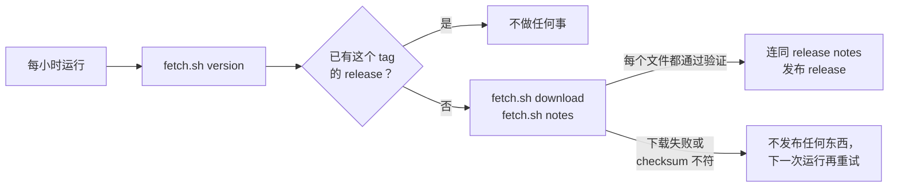

# Binary Mirror Template

[English](README.md) | [繁體中文](README.zh-TW.md) | 简体中文

把其他项目预先编译好的可执行文件镜像到 GitHub Releases 的模板，供能访问 GitHub、却无法访问上游下载服务器的环境使用。[Mai0313/claude-code-binaries](https://github.com/Mai0313/claude-code-binaries) 就是用它创建的。

点击 [Use this template](../../generate) 创建新的镜像。

## 工作方式

`.github/workflows/updater.yml` 每小时运行一次：



`scripts/fetch.sh` 是唯一与上游相关的文件：

```bash
./scripts/fetch.sh version                # 上游最新版本
./scripts/fetch.sh download VERSION dist  # VERSION 的所有文件，已验证
./scripts/fetch.sh notes VERSION          # VERSION 的 release notes
```

模板中的三个命令都是会直接失败的 stub。它们要用到的 helper 已经写在同一个文件里。

## 创建镜像

1. 根据你的上游，实现 `scripts/fetch.sh` 的三个命令。
2. 改写三份 README，说明这个镜像：镜像的是什么、如何安装和验证。
3. 在 repository 设置中允许 GitHub Actions 创建和 approve pull request，让 Dependabot 和 pre-commit 的更新能自动 merge。
4. 开一个修改 `scripts/fetch.sh` 的 pull request：它会运行完整下载但不发布。merge 之后，`main` 上的运行会发布上游的最新版本。

给 coding agent 的细节写在 `AGENTS.md`。

## 其他内置功能

- 代码质量：每个 pull request 都会运行 pre-commit（hooks 见 `.pre-commit-config.yaml`），hooks 每天自动更新。
- Secret scanning 和 CodeQL、GitHub Actions 的 Dependabot 和自动 merge、semantic pull request 标题，以及按分支名称添加的 pull request label。
