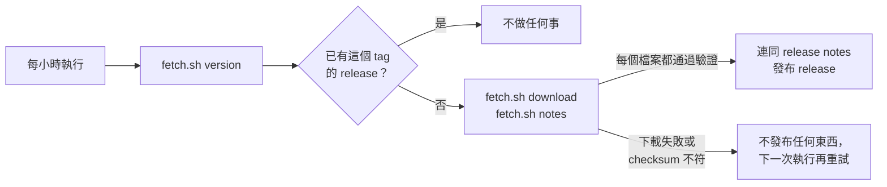

# Binary Mirror Template

[English](README.md) | 繁體中文 | [简体中文](README.zh-CN.md)

把其他專案預先編譯好的執行檔鏡像到 GitHub Releases 的模板，給能連上 GitHub、卻連不上上游下載伺服器的環境使用。[Mai0313/claude-code-binaries](https://github.com/Mai0313/claude-code-binaries) 就是用它建立的。

點選 [Use this template](../../generate) 建立新的鏡像。

## 運作方式

`.github/workflows/updater.yml` 每小時執行一次：



`scripts/fetch.sh` 是唯一與上游相關的檔案：

```bash
./scripts/fetch.sh version                # 上游最新版本
./scripts/fetch.sh download VERSION dist  # VERSION 的所有檔案，已驗證
./scripts/fetch.sh notes VERSION          # VERSION 的 release notes
```

模板裡的三個指令都是會直接失敗的 stub。它們要用到的 helper 已經寫在同一個檔案裡。

## 建立鏡像

1. 依照你的上游，實作 `scripts/fetch.sh` 的三個指令。
2. 改寫三份 README，說明這個鏡像：鏡像的是什麼、如何安裝與驗證。
3. 在 repository 設定中允許 GitHub Actions 建立與 approve pull request，讓 Dependabot 與 pre-commit 的更新能自動 merge。
4. 開一個修改 `scripts/fetch.sh` 的 pull request：它會執行完整下載但不發布。merge 之後，`main` 上的執行會發布上游的最新版本。

給 coding agent 的細節寫在 `AGENTS.md`。

## 其他內建功能

- 程式碼品質：每個 pull request 都會執行 pre-commit（hooks 見 `.pre-commit-config.yaml`），hooks 每天自動更新。
- Secret scanning 與 CodeQL、GitHub Actions 的 Dependabot 與自動 merge、semantic pull request 標題，以及依分支名稱加上的 pull request label。
